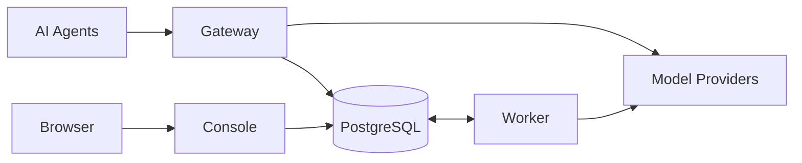

<p align="center">
  
</p>

<h1 align="center">LLMIngress</h1>

<p align="center">Route your AI agents across the model providers you already use.</p>

<p align="center">
  
  <a href="https://github.com/IamNotShady/LLMIngress/stargazers"></a>
  <a href="https://github.com/IamNotShady/LLMIngress/actions/workflows/ci.yml"></a>
  <a href="LICENSE"></a>
</p>

## What is LLMIngress?

LLMIngress is an open-source, self-hosted AI Gateway for agents. Connect Provider API keys,
subscription accounts, and local model servers, expose them through stable Virtual Model names,
and control routing, access, limits, fallback, and usage from one Console.

- 🔀 Route Virtual Models with `fixed`, `cost_first`, or `random` policies
- 🚑 Track the health of each Provider connection and fall back before streaming begins
- 🔐 Give every Agent a dedicated API key and explicit Virtual Model grants
- 🛡️ Enforce optional budget, RPM, TPM, token, and concurrency limits
- 📊 Track activity, tokens, latency, failures, fallback, connection health, and request cost
- 🕶️ Keep prompts, successful responses, tool arguments, and credentials out of operational logs

## Quick start

### Self-hosted with Docker Compose

Clone the repository and generate independent secrets for credential encryption and PostgreSQL:

```bash
git clone https://github.com/IamNotShady/LLMIngress.git
cd LLMIngress

export MASTER_KEY="$(node -e "console.log(require('node:crypto').randomBytes(32).toString('base64url'))")"
export POSTGRES_PASSWORD="$(node -e "console.log(require('node:crypto').randomBytes(32).toString('base64url'))")"

docker compose up --build
```

Compose starts PostgreSQL 18.4, applies the baseline migration, then starts Console, Gateway, and
Worker. Published ports bind to `127.0.0.1` by default.

| Service | Address | Purpose |
| --- | --- | --- |
| Console | [http://localhost:3000](http://localhost:3000) | Configure and observe LLMIngress |
| Gateway | [http://localhost:4000](http://localhost:4000) | Serve Agent API traffic |
| PostgreSQL | `localhost:55432` | Store configuration and operational metadata |
| Worker | Internal only | Refresh models, probe connections, and synchronize prices |

Runtime and port overrides are documented in [`.env.example`](.env.example).

### Send your first request

Open [http://localhost:3000](http://localhost:3000), create the administrator password, then:

1. Add a Provider connection.
2. Create a Virtual Model with at least one candidate.
3. Create an Agent allowed to use that Virtual Model.
4. Copy the Agent's one-time `llmi_` API key.

```bash
curl http://localhost:4000/v1/chat/completions \
  --header "Authorization: Bearer llmi_your_agent_key" \
  --header "Content-Type: application/json" \
  --data '{
    "model": "your-virtual-model",
    "messages": [{"role": "user", "content": "Hello"}]
  }'
```

## Providers

LLMIngress supports remote API keys, subscription OAuth, and local model servers. The current
built-in templates are:

| Connection type | Built-in templates |
| --- | --- |
| Subscription | OpenAI Codex, Claude Code |
| API key | Google Gemini, OpenRouter, DeepSeek, xAI, Qwen, Moonshot/Kimi, MiniMax, Z.ai |
| Local | Ollama, LM Studio, llama.cpp |

Model refresh can enrich Provider catalogs with capability and price data from models.dev,
OpenRouter, LiteLLM, and Vercel. Missing metadata remains unknown, and manual values take
precedence.

Health belongs to a Provider connection: each API key or OAuth token is checked independently,
while a Local Provider has one logical connection. Confirmed unhealthy connections are filtered
from routing until a successful probe recovers them.

## Gateway APIs

Agents use the same API key and Virtual Model grants across all supported protocols:

| Protocol | Endpoint |
| --- | --- |
| OpenAI Chat Completions | `POST /v1/chat/completions` |
| OpenAI Responses | `POST /v1/responses` |
| Anthropic Messages | `POST /v1/messages` |
| OpenAI Embeddings | `POST /v1/embeddings` |
| Virtual Model discovery | `GET /v1/models` |

Provider payloads remain protocol-native. LLMIngress replaces the Virtual Model name with the
selected Provider model while preserving the Provider request and response contract.

Gateway health endpoints do not require an Agent API key:

| Endpoint | Purpose |
| --- | --- |
| `GET /health/live` | Process liveness |
| `GET /health/ready` | Database and configuration readiness |
| `GET /health` | Readiness-compatible alias |

## How it works



- **Gateway** authenticates Agents, enforces enabled limits, resolves Virtual Models, executes
  fallback, and records request metadata.
- **Console** owns configuration and operational views. It does not proxy Agent traffic or call
  Providers.
- **Worker** performs model discovery, exact Provider-connection probes, and price synchronization.
- **PostgreSQL** stores durable configuration, jobs, usage, cost, fallback, and connection health.

## Local development

LLMIngress uses Node.js 24, pnpm 11.5.1, and PostgreSQL 18.4.

```bash
pnpm install
cp .env.example .env.local
# Set MASTER_KEY and confirm DATABASE_URL / TEST_DATABASE_URL in .env.local.
pnpm run db:migrate
./init.sh
```

`./init.sh` runs lint, type-checking, unit tests, and the build before starting Console, Gateway,
and Worker. The standalone verification commands are:

```bash
pnpm run verify
pnpm run verify:features
```

The project is pre-release. The current `0001_core_baseline.sql` schema is authoritative;
databases created from older development migration histories should be recreated rather than
upgraded in place.

## Quick links

- [Product scope](docs/PRODUCT.md)
- [Architecture](docs/ARCHITECTURE.md)
- [Coding guide](docs/CODING_GUIDE.md)
- [Feature status](feature_list.json)
- [CI](https://github.com/IamNotShady/LLMIngress/actions/workflows/ci.yml)

## Contributing

Read [AGENTS.md](AGENTS.md) and the [coding guide](docs/CODING_GUIDE.md) before changing behavior.
Work on one feature at a time, write unit and E2E coverage before implementation, and run both
verification commands before marking a feature complete.

## License

[Apache License 2.0](LICENSE)
