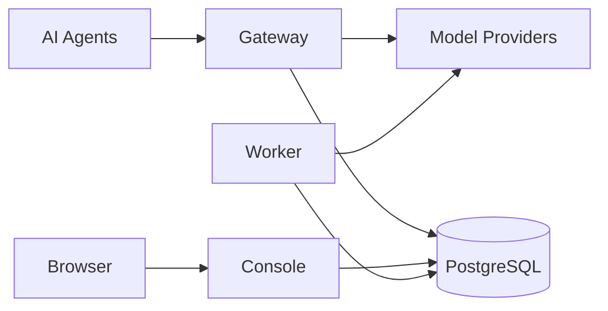

<p align="center">
  
</p>

<h1 align="center">LLMIngress</h1>

<p align="center">
  Route AI agent traffic across real model providers through one controlled ingress.
</p>

<p align="center">
  <a href="https://github.com/IamNotShady/LLMIngress/actions/workflows/ci.yml"></a>
  <a href="https://github.com/IamNotShady/LLMIngress/stargazers"></a>
  <a href="LICENSE"></a>
  
</p>

## What is LLMIngress?

LLMIngress is an open-source, self-hosted AI Gateway for AI agents. Connect provider API keys,
subscription accounts, and local model servers; expose them through stable Virtual Model names;
then control routing, access, limits, fallback, and usage from one Console.

- 🔀 Route Virtual Models with `fixed`, `cost_first`, or `random` policies
- 🚑 Filter unhealthy candidates and fall back before response streaming begins
- 🔐 Give each Agent a dedicated API key and explicit Virtual Model grants
- 🛡️ Enforce optional budget, RPM, TPM, token, and concurrency limits
- 📊 Track activity, tokens, latency, failures, fallback, health, and request cost
- 🕶️ Keep outbound prompts, successful responses, tool arguments, and credentials out of
  operational logs

## Quick start

### Docker Compose

Clone the repository and generate independent secrets for encryption and PostgreSQL:

```bash
git clone https://github.com/IamNotShady/LLMIngress.git
cd LLMIngress

export MASTER_KEY="$(node -e "console.log(require('node:crypto').randomBytes(32).toString('base64url'))")"
export POSTGRES_PASSWORD="$(node -e "console.log(require('node:crypto').randomBytes(32).toString('base64url'))")"

docker compose up --build
```

Open [http://localhost:3000](http://localhost:3000) and create the administrator password. Compose
runs migrations once, then starts the complete stack:

| Service | Address | Purpose |
| --- | --- | --- |
| Console | [http://localhost:3000](http://localhost:3000) | Configure and observe LLMIngress |
| Gateway | [http://localhost:4000](http://localhost:4000) | Serve Agent API traffic |
| PostgreSQL | `localhost:55432` | Store configuration and runtime metadata |
| Worker | Internal only | Refresh models, check connectivity, and sync prices |

Published ports bind to `127.0.0.1` by default. See [`.env.example`](.env.example) for port,
host, and runtime overrides.

### Send a request

In the Console, add a Provider, create a routable Virtual Model, and create an Agent with access
to that model. Use the one-time `llmi_` API key returned for the Agent:

```bash
curl http://localhost:4000/v1/chat/completions \
  --header "Authorization: Bearer llmi_your_agent_key" \
  --header "Content-Type: application/json" \
  --data '{
    "model": "your-virtual-model",
    "messages": [{"role": "user", "content": "Hello"}]
  }'
```

## Gateway APIs

Agents use the same API key and Virtual Model grants across the supported protocols:

| Protocol | Endpoint |
| --- | --- |
| OpenAI Chat Completions | `POST /v1/chat/completions` |
| OpenAI Responses | `POST /v1/responses` |
| Anthropic Messages | `POST /v1/messages` |
| OpenAI Embeddings | `POST /v1/embeddings` |
| Virtual Model discovery | `GET /v1/models` |

Provider payloads remain protocol-native. LLMIngress replaces the Virtual Model name with the
selected real model id while preserving the provider request and response contract.

## Providers

LLMIngress includes templates for remote API keys, subscription OAuth, and local model servers.
Available protocols depend on the selected Provider.

| Connection | Built-in templates |
| --- | --- |
| Subscription | OpenAI Codex, Claude Code |
| API key | Google Gemini, OpenRouter, DeepSeek, xAI, Qwen, Moonshot/Kimi, MiniMax, Z.ai |
| Local | Ollama, LM Studio, llama.cpp |

Model refresh can enrich Provider catalogs with capability and price data from models.dev,
OpenRouter, LiteLLM, and Vercel. Missing metadata remains explicit instead of being guessed from
model names.

## How it works



- **Gateway** authenticates Agents, enforces enabled limits, resolves Virtual Models, executes
  fallback, and records request metadata.
- **Console** owns configuration and operational views.
- **Worker** performs model discovery, Provider connectivity checks, and price synchronization.
- **PostgreSQL** stores durable configuration, jobs, usage, cost, fallback, and health state.

## Local development

LLMIngress uses Node.js 24, pnpm 11.5.1, and PostgreSQL 16.

```bash
pnpm install
cp .env.example .env.local
# Set MASTER_KEY and confirm DATABASE_URL / TEST_DATABASE_URL in .env.local.
pnpm run db:migrate
./init.sh
```

`./init.sh` runs lint, type-checking, unit tests, and builds before starting Console, Gateway, and
Worker. Full verification commands:

```bash
pnpm run verify
pnpm run verify:features
```

The project is pre-release. The current baseline schema is authoritative; databases created from
older development migration histories should be recreated rather than upgraded in place.

## Quick links

- [Product scope](docs/PRODUCT.md)
- [Architecture](docs/ARCHITECTURE.md)
- [Coding guide](docs/CODING_GUIDE.md)
- [Feature status](feature_list.json)
- [CI](https://github.com/IamNotShady/LLMIngress/actions/workflows/ci.yml)

## Contributing

Read [AGENTS.md](AGENTS.md) and the [coding guide](docs/CODING_GUIDE.md) before changing behavior.
Work on one feature at a time, add unit and E2E coverage before implementation, and run both
verification commands before marking the feature complete.

## License

[Apache License 2.0](LICENSE)
