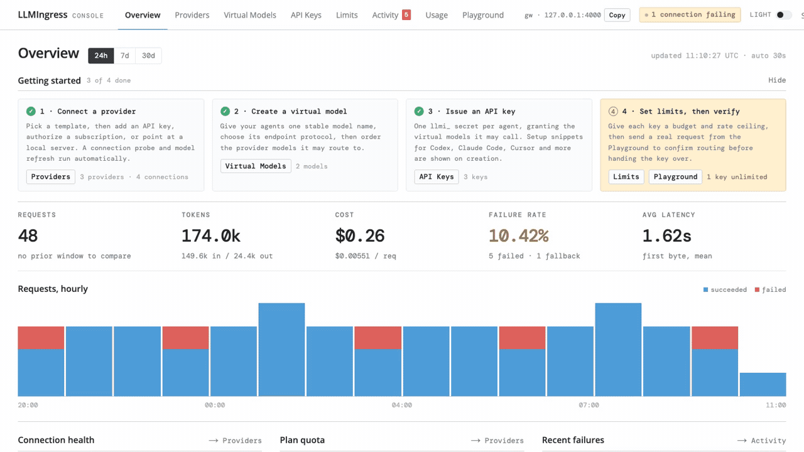

<p align="center">
  
</p>

<h1 align="center">LLMIngress</h1>

<p align="center">把你的 AI Agent 路由到你已经在用的模型提供商。</p>

<p align="center">
  <a href="https://llmingress.ai">llmingress.ai</a> · <a href="https://github.com/IamNotShady/LLMIngress/releases">版本发布</a>
</p>

<p align="center">
  [<a href="../README.md">English</a>] [<a href="README.zh-CN.md">简体中文</a>]
</p>

<p align="center">
  
</p>

<p align="center">
  
  <a href="https://github.com/IamNotShady/LLMIngress/stargazers"></a>
  <a href="https://github.com/IamNotShady/LLMIngress/actions/workflows/ci.yml"></a>
  <a href="../LICENSE"></a>
</p>

## LLMIngress 是什么？

LLMIngress 是一个开源、可自托管的 Agent AI 网关。接入 Provider API Key、订阅账号和本地模型服务，
通过稳定的虚拟模型（Virtual Model）名称对外暴露，并在同一个 Console 中统一管理路由、访问控制、
限流、回退与用量。

- 🔀 按 `fixed`、`cost_first`、`load_balance` 或请求头驱动的 `tag` 策略路由虚拟模型
- 🚑 跟踪每个 Provider 连接的健康状态，并在流式输出开始前完成回退
- 🔐 为每个 agent 或工具创建专属 API Key，并显式授予可用的虚拟模型
- 🛡️ 可选执行预算、RPM、TPM、Token 与并发限制
- 📊 跟踪活动、Token、延迟、失败、回退、连接健康与请求成本
- 🕶️ 不把提示词、成功响应、工具参数和凭证写入运维日志

## 快速开始

### 使用 Docker Compose 自托管

```bash
git clone https://github.com/IamNotShady/LLMIngress.git
cd LLMIngress
./scripts/deploy.sh
```

`./scripts/deploy.sh` 会在缺少配置时把随机 `ENCRYPTION_KEY` 写入已被 gitignore 的 `.env`，
然后重新构建并创建 Compose 容器，以修复陈旧的容器网络状态；PostgreSQL 命名数据卷会被保留。
`main` 分支使用 Compose project `llmingress`；其它分支使用隔离的
`llmingress-<规范化分支名>`，并各自拥有容器、网络和 PostgreSQL 数据卷。重新部署时只保留
当前分支对应的命名卷。Compose 仍使用仅限本地的默认 PostgreSQL 密码
（`llmi-local-db`）。对外端口默认绑定到 `127.0.0.1`。请妥善备份每个 worktree 的
`.env` —— 解密该分支已存储的 Provider 凭证需要同一个 `ENCRYPTION_KEY`。

不同分支默认发布相同端口；启动另一分支前应先停止当前分支，或者覆盖
`CONSOLE_PORT`、`GATEWAY_PORT` 和 `POSTGRES_PORT`。Compose 会根据 `GATEWAY_PORT`
自动生成 Console 使用的公开 Gateway 地址；只有需要指定外部地址时才设置
`GATEWAY_URL`。

仓库的所有启动入口都按同一优先级解析每个变量：当前 Shell、`.env.local`、`.env`、
最后是代码默认值。存在 `.env.local` 时，`./scripts/deploy.sh` 会把两个文件依次传给
Compose；`./init.sh` 和 `pnpm dev` 则使用仓库共享的环境变量加载器。
`DATABASE_URL` 用于宿主机进程；Docker 改用 `COMPOSE_DATABASE_URL`，因为应用容器需要
通过 Compose 服务名连接 PostgreSQL。

Compose 会运行两个容器：应用容器（同一进程组内包含 Console、Gateway 与 Worker）和
PostgreSQL。

| 端点 | 地址 | 用途 |
| --- | --- | --- |
| Console | [http://localhost:3000](http://localhost:3000) | 配置与观测 LLMIngress |
| Gateway | [http://localhost:4000](http://localhost:4000) | 承载 API Key 流量 |
| PostgreSQL | `localhost:55432` | 存储配置与运维元数据 |
| Worker | 应用容器内部 | 刷新模型、探测连接与配额并同步价格 |

运行时与端口覆盖说明见 [`.env.example`](../.env.example)。

### 发送第一个请求

打开 [http://localhost:3000](http://localhost:3000)，创建管理员密码，然后：

1. 添加一个 Provider 连接。
2. 创建一个至少包含一个候选的虚拟模型。
3. 创建一个被允许使用该虚拟模型的 API Key。
4. 复制一次性 `llmi_` API Key。

```bash
curl http://localhost:4000/v1/chat/completions \
  --header "Authorization: Bearer llmi_your_api_key" \
  --header "Content-Type: application/json" \
  --data '{
    "model": "your-virtual-model",
    "messages": [{"role": "user", "content": "Hello"}]
  }'
```

## Providers

LLMIngress 支持远程 API Key、订阅 OAuth 与本地模型服务。当前内置模板包括：

| 连接类型 | 内置模板 |
| --- | --- |
| 订阅 | Claude Code、OpenAI Codex、Grok、MiniMax Coding Plan |
| API Key | Anthropic、AWS Bedrock、BytePlus ModelArk、Cerebras、ClinePass、Command Code、DeepSeek、Fireworks AI、GLM Coding Plan、Google Gemini、Groq、Kimi Coding Plan、MiniMax、Mistral、Mistral Vibe、Moonshot/Kimi、NousResearch、NVIDIA NIM、Ollama Cloud、OpenAI、OpenCode Go、OpenRouter、Qwen、Qwen Token Plan、xAI、Xiaomi MiMo、Xiaomi MiMo Token Plan、Z.ai |
| 本地 | Ollama、LM Studio、llama.cpp |

模型刷新可从 models.dev、OpenRouter、LiteLLM 与 Vercel 补充 Provider 目录中的能力与价格数据。
缺失的元数据保持未知，手动填写的值优先。

健康状态归属 Provider 连接：每个 API Key 或 OAuth Token 都会独立检查，
而本地 Provider 只有一个逻辑连接。已确认不健康的连接会从路由中过滤，
直到探测成功后恢复。

对于会报告上游用量的 Provider —— 订阅窗口、月度预算或 Token 套餐 ——
会定期执行配额探测，Console 中按连接展示剩余配额。

## Gateway API

API Key 在所有支持的协议中使用同一套虚拟模型授权：

| 协议 | 端点 |
| --- | --- |
| OpenAI Chat Completions | `POST /v1/chat/completions` |
| OpenAI Responses | `POST /v1/responses` |
| Anthropic Messages | `POST /v1/messages` |
| 虚拟模型发现 | `GET /v1/models` |

Provider 载荷保持协议原生形态。LLMIngress 会把虚拟模型名称替换为选中的
Provider 模型，同时保留 Provider 的请求与响应约定。

Gateway 健康检查端点不需要 API Key：

| 端点 | 用途 |
| --- | --- |
| `GET /health/live` | 进程存活 |
| `GET /health/ready` | 数据库与配置就绪 |
| `GET /health` | 与就绪检查兼容的别名 |

## 工作原理

- **Gateway** 认证 API Key、执行已启用的限制、解析虚拟模型、执行回退，并记录请求元数据。
- **Console** 负责配置与运维视图。它不代理 API Key 流量，也不直接调用 Provider。
- **Worker** 负责模型发现、精确的 Provider 连接探测、上游配额探测，以及价格同步。
- **PostgreSQL** 存储持久化配置、任务、用量、成本、回退与连接健康数据。

## 本地开发

LLMIngress 需要 Node.js 24、pnpm 11.5.1 与 PostgreSQL 18.4。

```bash
pnpm install
cp .env.example .env.local
# 设置 ENCRYPTION_KEY（例如 openssl rand -base64 32），并确认 DATABASE_URL / TEST_DATABASE_URL。
pnpm run db:migrate
./init.sh
```

若要从源码检出按接近生产形态运行，执行 `./scripts/deploy.sh`。
Compose 会构建一个多角色应用镜像，并以单个应用容器与 PostgreSQL 一起运行
（开发时发布在 `127.0.0.1:55432`）。

`./init.sh` 会先运行 lint、类型检查、单元测试与构建，再启动 Console、Gateway
与 Worker。`pnpm dev` 使用相同的环境文件优先级，但不会执行验证门禁。独立的验证命令为：

```bash
pnpm run verify
pnpm run verify:features
```

项目仍处于预发布阶段。当前以 `0001_core_baseline.sql` schema 为准；
基于更早开发期迁移历史创建的数据库应重建，而不是原地升级。

## 相关链接

- [产品范围](PRODUCT.md)
- [架构](ARCHITECTURE.md)
- [编码指南](CODING_GUIDE.md)
- [功能状态](../feature_list.json)
- [CI](https://github.com/IamNotShady/LLMIngress/actions/workflows/ci.yml)

## 贡献

在修改行为前，请先阅读 [AGENTS.md](../AGENTS.md) 与 [编码指南](CODING_GUIDE.md)。
一次只做一项功能，先写单元测试与 E2E 覆盖，再实现；在把功能标记为完成前，
请运行两条验证命令。

## 许可证

[Apache License 2.0](../LICENSE)
